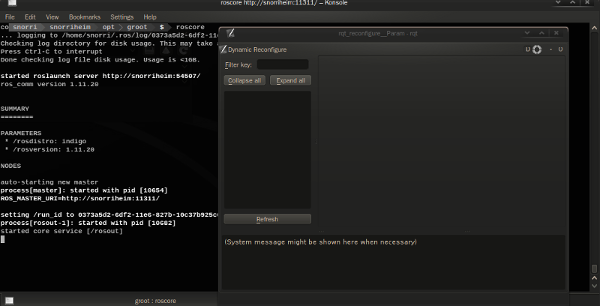
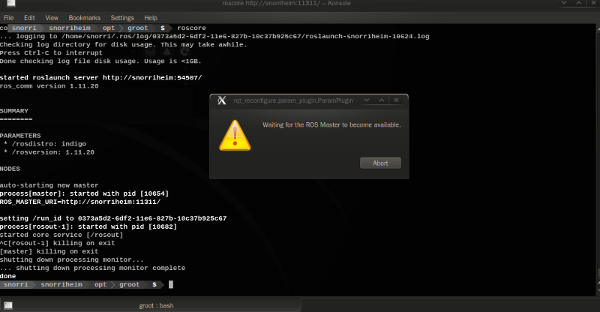

# RQT Wrapper

## Overview

Wrap an rqt plugin so that it automagically goes down and comes up as a ROS master
at the other end goes down and comes back up again. This solves the frustration of
having to restart all of your rqt applications on your laptop/pc every time you
teardown the robot and relaunch it again. Incidentally it will save time and effort as well.

**WRQT Reconfigure - With ROS Core**



**WRQT Reconfigure - Absent ROS Core**



The source code is released under a [BSD 3-Clause license](LICENSE).

## Status

Beta. Areas to be addressed:

* Desktop notifications instead of a dialog while ros is down, #4.
* Reflect all of the arguments that rqt programs usually let you handle, #5.

## Usage

Just two lines. This example wraps the `rqt_reconfigure` plugin:

```python
import rqt_wrapper
import sys

if __name__ == '__main__':
    rqt_wrapper = rqt_wrapper.RQTWrapper('rqt_reconfigure.param_plugin.ParamPlugin')
    sys.exit(rqt_wrapper.exec_())
```

## Programs

Some of the common rqt programs are recreated here with the `wrqt_xxx` prefix and
deposited into the global bin directory.

* `wrqt_graph`
* `wrqt_reconfigure`
* `wrqt_robot_monitor`

